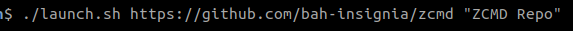
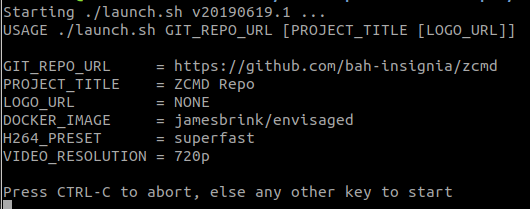
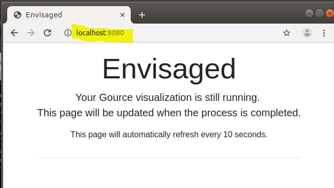
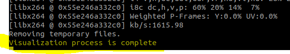
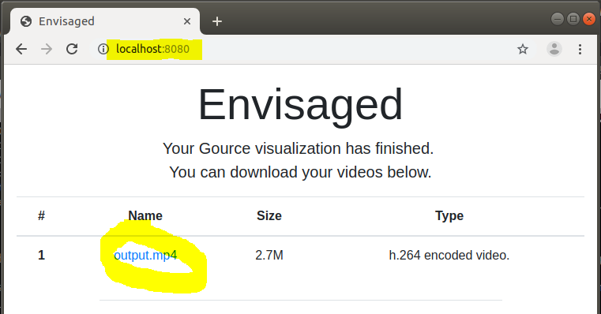
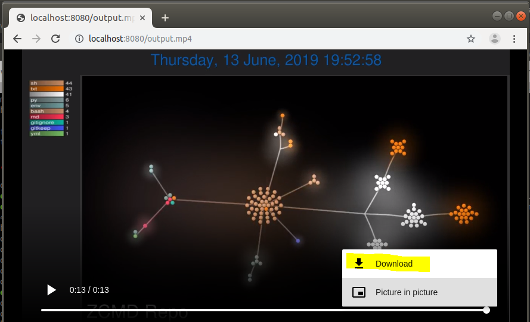

PURPOSE
=======
Generate movies of git repo activity by providing a simple shell script.

REQUIREMENTS
------------
You already have Docker utilities installed.

USAGE
-----
Run the launch.sh script from your linux console and open the the interface at http://localhost:8080/

```
./launch.sh GIT_REPO_URL PROJECT_TITLE LOGO_URL
```

* GIT_REPO_URL = (REQUIRED) fully qualified url to a git repo.
* PROJECT_TITLE = (OPTIONAL) text to appear as the title; defaults to git url.
* LOGO_URL = (OPTIONAL) fully qualified url to logo; defaults to no logo.

EXAMPLE
-------
1. Launch script in console with the URL to the git repo you want to "film".



2. Verify the values when prompted; press ENTER key to kick off the show!



3. Wait for the gource application to finish making your mp4 movie.  The browser at __localhost:8080__ will show a temporary message until the movie is ready.



4. The console will show you when the film is ready.



5. Watch the movie in the browser when ready.



6. Download your mp4 movie by clicking the menu link in the lower right hand part of the browser page.



SOURCE
------
Copy of entire source project copied from original author is in the Envisaged folder.
Copy is from https://github.com/utensils/Envisaged

